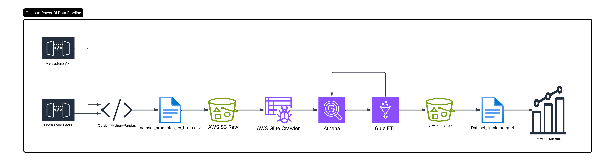

# 🛒 Pipeline ETL y Análisis de Productos (Mercadona & Open Food Facts)

[](https://github.com) [](https://github.com) [](https://github.com) [](https://github.com)

## 🎯 Objetivo del Proyecto
El objetivo de este proyecto es construir un **dataset real y enriquecido** de productos de supermercado (datos obtenidos mediante las APIs de Mercadona y Open Food Facts) que integre información tanto nutricional como comercial.

A partir de este dataset, se realiza un análisis económico y nutricional profundo con el fin de extraer conclusiones útiles en la toma de decisiones de compra, ayudando a los consumidores a identificar productos que ofrezcan un mejor equilibrio entre precio y calidad bajo distintos escenarios:
* 💰 **Cuando el presupuesto es el factor determinante.**
* 🍏 **Cuando el valor nutricional tiene mayor prioridad que el precio.**

Todo este análisis se materializa en un informe interactivo en **Power BI**, permitiendo filtrar productos por marca, categoría y características mediante rankings dinámicos de referencia.

---

## 🗺️ Arquitectura de Datos (Pipeline ETL)
A continuación se detalla el flujo de datos de extremo a extremo y la integración tecnológica implementada en el proyecto:



1. **Ingesta e Ingestion Incremental:** Extracción automatizada y enriquecimiento de datos de APIs mediante **Python y Pandas**, implementando lógica de tolerancia a fallos, reintentos y *rate-limiting* controlado. El dataset se actualizó de forma incremental en un archivo CSV local y posteriormente se cargó en un bucket de **Amazon S3** (Capa *Raw*).
2. **Análisis Exploratorio (EDA):** Ejecución de consultas SQL en **Amazon Athena** sobre los metadatos generados por un **AWS Glue Crawler** para analizar la calidad del dato, identificar nulos y aislar valores atípicos (*outliers*).
3. **Transformación y Limpieza (ETL):** Desarrollo de un script robusto en **AWS Glue con PySpark** para el tipado de variables, filtrado de categorías fuera de alcance y normalización de estructuras complejas. El dataset optimizado se almacenó nuevamente en **Amazon S3** (Capa *Silver*) en formato columnar **Parquet**.
4. **Consumo y Dashboard:** Modelado de datos, transformación final mediante **Power Query** (adaptado al estándar decimal de España) y diseño del cuadro de mando interactivo en **Power BI**.

---

## 📁 Estructura del Repositorio

```text
├── 1_codigo_ingesta_apis/                  # Extracción incremental y consumo de APIs (.ipynb)
├── 2_transformaciones_aws_y_consultas_sql/ # Script PySpark en AWS Glue (.py) y consultas de auditoría en Athena (.sql)
├── 3_reporte_powerbi/                      # Informe interactivo nativo (.pbix) y exportación estática (.pdf)
├── 4_capturas/                             # Capturas del cuadro de mando y PDF con bitácora técnica de AWS
├── 5_data/                                 # Datasets del proyecto por capas de madurez (Medallion Architecture)
│   ├── raw/                                # Datos originales extraídos con anomalías (.csv)
│   └── silver/                             # Dataset optimizado y limpio tras procesamiento con PySpark (.parquet)
├── Diagrama_de_flujo_ETL.png               # Diagrama de la arquitectura del pipeline de datos
└── README.md                               # Documentación principal del proyecto
```

---

## 📊 Insights Destacados del Dashboard

### 1. Eficiencia Proteica y Comercial
Análisis del ratio óptimo de **gramos de proteína por euro invertido** entre múltiples categorías alimenticias para identificar las opciones de compra con mayor densidad proteica al menor costo posible.
* 📄 *Ubicación:* Página 1 del reporte de Power BI.

### 2. Cruce entre Nutri-Score y Clasificación NOVA
Análisis conjunto de los sistemas de etiquetado nutricional para desenmascarar productos ultraprocesados (NOVA 4) que logran obtener calificaciones falsamente saludables (Nutri-Score A/B).
* 📄 *Ubicación:* Página 3 del reporte de Power BI.

> 💡 **Nota Técnica:** En la carpeta `4_capturas/` se incluye un documento PDF resumido que contiene la bitácora detallada con las consultas ejecutadas en Amazon Athena, la resolución de anomalías en la consola de AWS y las reglas de negocio aplicadas.

---

**Contacto:** Pablo Cesar Lira Cares | [LinkedIn](https://www.linkedin.com/in/pablo-lira-cares-2a4152368/)